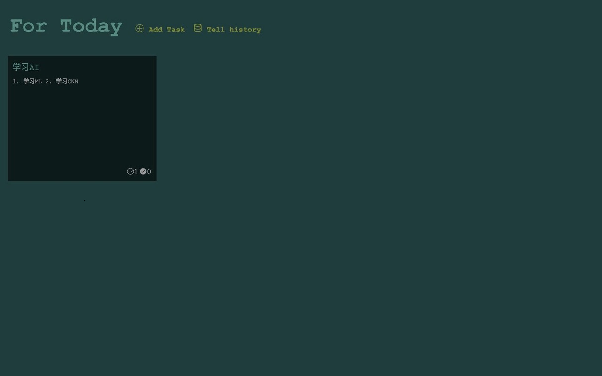
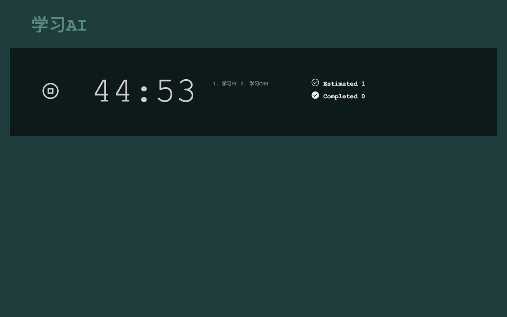

# time-reminder

一个简单的定时任务提醒的chome插件，功能类似windows上面的zamora。

## 插件截图
- 今日任务列表：



- 开始一个任务



- 查看历史任务：


## 继续开发

```bash
npm install
npm run dev
npm run build
```

## 参考资源
- [Chrome插件开发攻略](https://www.cnblogs.com/liuxianan/p/chrome-plugin-develop.html)  
- [Google chrome API](https://developer.chrome.com/extensions/api_index#stable_apis) 
- [Generator-chrome-extension](https://github.com/yeoman/generator-chrome-extension)  
- [Vue+webpack模板使用](https://github.com/ALiangLiang/vue-webpack-chrome-extension-template)
- [Generator-chrome-extension结合Vue使用](https://blog.damirmiladinov.com/vuejs/building-chrome-extension-with-vue.html#.WzecVtgzaUs)  
